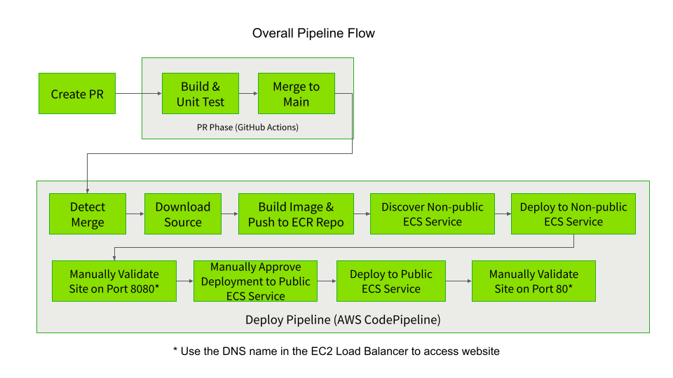

# Pet Clinic with Blue-Green Deployment

This repo is a combination of the [Spring Pet Clinic repo](https://github.com/spring-projects/spring-petclinic)
and the [AWS ECS Blue-Green Deployment repo](https://github.com/aws-samples/ecs-blue-green-deployment).

Original readme for the pet clinic repo is [here](./docs/readme-orig.md)

## Pipeline Design

The intent of the design is to show off the power of blue-green deployments. As deployments to the
non-public side can happen well in advance of a deployment to the public. Thus, testing and validation
can be done well before the swap to public view. Meaning this can be done early in the day while people
are around, especially if they require a late night deployment to public view. This greatly shortens the
deployment window to the time it takes to swap ESC services from port 8080 to 80 and viceversa.

The pipeline consists of GitHub Actions and AWS CodePipeline. The Actions take care of the PR stage,
which runs Spring package command. This compiles, tests and create a jar file in the target folder.
Once the file passes it PR checks and is merged to main. Then CodePipeline will detect the change
and start the pipeline.

The CodePipeline retrieves the files from the GitHub repo. Then builds the runs the Spring package
command again to generate the jar file. Docker build is used to create the image and place the
jar in the image, so it executes when the container runs. The image is then placed in AWS ECR for
later use by the ECS services.

The next stage is discovery. It identifies which ECS service is running on port 80 and 8080. This
info is used for the deployment to the ESC service running on port 8080. In this scenario, port
8080 is our non-public IP, while port 80 is public.

Once discovery is done, the next step is deploy. The new image replaces the old image in the ECS
service connected to port 8080. Once the deployment is done, the CodePipeline waits for the user
to approve the swap of ECS services. The service tied to port 8080 will move to port 80 and viceversa.

During this time the new image can be validate and tested using the EC2 Load Balancer DNS name on
port 8080. The URL should look something like this: `http://spring-petclinic-421952290.us-east-1.elb.amazonaws.com:8080/`

Once you are happy with the new image on port 8080. Then approve the swap in CodePipeline. Once
complete, the new image will be on port 80 and the previously public image will now be on port 8080.
This completes the flow of the pipeline.



## Cloud Design

In the base install there is a VPC network and a CodePipeline with support resources. One support resource of unique
note is the Lambda function use to flip the ESC services from port 8080 to 80 and viceversa. When the pipeline does a
deployment, it creates a load balancer, a blue and green ECS services. The load balancer just has a security group as
part of its deployment template. While the blue and green services have ECS service and support resources, but also a
load balancer listener and listener rule.

## Run the App Locally

If you are interested in running the app locally, use the following command:

```console
./mvnw spring-boot:run
```

## Deploy to AWS

This is the condensed version, more details are [here](./infra/README.md)

Prerequisites:

- Need to install AWS CLI
- Recommend setting up a non-root AWS account
  - Your CLI [configuration](http://docs.aws.amazon.com/cli/latest/userguide/cli-chap-getting-started.html) need PowerUserAccess and IAMFullAccess [IAM policies](http://docs.aws.amazon.com/IAM/latest/UserGuide/access_policies.html) associated with your credentials
- Login into AWS CLI
- Create a public S3 bucket
- Come up with a name for your CloudFormation stack
- Need the GitHub username
- Need a Github Token for authentication
  - If creating a fine-grained token, it needs at a minimum:
    - Read access to code, commit statuses, metadata, and pull requests
- Bring up a console and make sure you are in the `infra` folder

Run this command, when ready:

```console
bin/deploy
```

Here are the inputs required to launch CloudFormation templates:

- **S3 Bucket**: Enter S3 Bucket for storing your CloudFormation templates and scripts. This bucket must be in the same region where you wish to launch all the AWS resources created by this example.
- **CloudFormation Stack Name**: Enter CloudFormation Stack Name to create stacks
- **GitHubUser**: Enter your GitHub Username
- **GitHubToken**: Enter your GitHub Token for authentication ([https://github.com/settings/tokens](https://github.com/settings/tokens))

This will build the AWS Codepipeline and VPC. The rest will be built when the pipeline runs, which will be triggered by the deploy.

## Clean Up the Cloud

Go to CloudFormation in AWS. When fully deployed, there will be two stacks. One with the name `spring-petclinic-for-fun` and
another with the name `spring-petclinic-for-fun-DeploymentPipeline-< RANDOM STRING >-ecs-cluster`. Select both of them in them
in the UI and click delete. This will remove all the AWS components for this demo.
